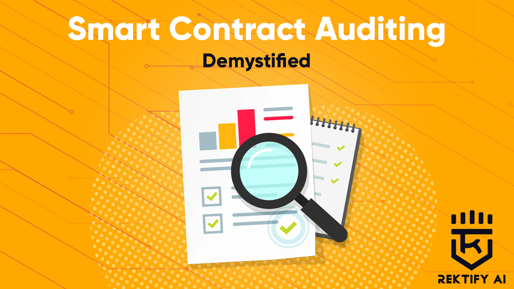
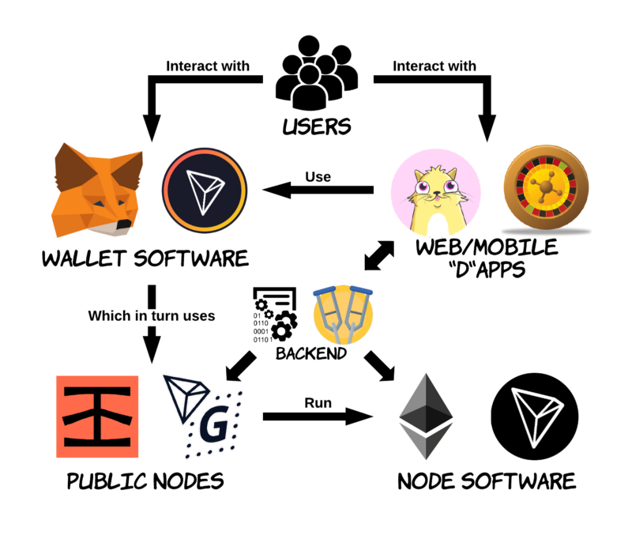

# How to get started as a smart contract auditor

Becoming a smart contract auditor can be daunting if you don't know where to start. The truth is you don't have to come from a super technical background to become a smart contract auditor. The eye for detecting where things can go wrong is a strongsuit most auditors have to foresee vulnerabilities that can graduate to detrimental attacks. Here is a concise repo of auditing resources from Youtube videos, articles, docs, and excerpts to get you started on your bug hunting journey. Please share. Let's make Web3 a safer place. </br>

- [ ] [Quick Start](https://start.blockchainhax.com) 🎊

----

<!-- image -->
<p align="center">
  
</p>

----
### Secure Smart Contract Development
- [ ] [OpenZepplin Contracts](https://github.com/OpenZeppelin/openzeppelin-contracts) </br>
- [ ] [Defender 2.0 by OpenZepplin](https://docs.openzeppelin.com/defender/v2/) </br>
- [ ] [Ethereum Improvement Proposals(EIP)](https://eips.ethereum.org/erc) </br>
- [ ] [How to become a smart contract auditor | The complete roadmap 2023](https://www.cyfrin.io/blog/how-to-become-a-smart-contract-auditor)

### Ethereum TL:DR
- [ ] [Whitepaper](https://ethereum.org/en/whitepaper/) </br>
- [ ] [Use-case for Smart Contracts](https://www.youtube.com/watch?v=kdvVwGrV7ec)
- [ ] [Zellic 2023 Smart Contract Source Index](https://huggingface.co/datasets/Zellic/smart-contract-fiesta)

### Youtube Videos
- [ ] [Bug Bounty Playlist](https://youtube.com/playlist?list=PLKB0wJ6ZsFfHOFFJijZTdQFUvwMS6oZg7) </br>
- [X] [Solidity Smart Contracts in 100 seconds](https://www.youtube.com/watch?v=kdvVwGrV7ec) </br>
- [X] [Smart Contract Security and Auditing 101 by Chainlink](https://www.youtube.com/watch?v=0aJfCug1zTM&list=PLKB0wJ6ZsFfHOFFJijZTdQFUvwMS6oZg7&index=6)
- [X] [EatTheBlocks: How to audit your smart contract code](https://www.youtube.com/watch?v=VAumxFQOU0o&list=LL&index=2&t=195s) </br>
- [ ] [EatTheBlocks: Gas Optimization in Solidity: 10 tips](https://www.youtube.com/watch?v=PYilP2bjtwc) </br>
- [ ] [NEAR Smart Contract Security Course](https://www.youtube.com/playlist?list=PL7Gwuo_MOL740lhKTvouCJvk4sAyuqZqT) </br>
- [ ] [32-Hour Course on Solidity](https://www.youtube.com/watch?v=gyMwXuJrbJQ) </br>
- [ ] [Secureum Bootcamp - Ethereum 101](https://youtu.be/44qhIBMGMoM) </br>
- [ ] [Rust Tutorial Full Course](https://www.youtube.com/watch?v=ygL_xcavzQ4) </br>
- [ ] [Secure Development Series](https://www.youtube.com/playlist?list=PLdJRkA9gCKOONBSlcifqLig_ZTyG_YLqz)
- [ ] [Spearbit DAO Youtube](https://www.youtube.com/@Spearbit/videos) </br>
- [ ] [SolidityATL Web3 Security Fall '23 Session 3](https://www.youtube.com/watch?v=hCY5j8L3JQM) </br>


### Testing Frameworks
- [X] [Truffle](https://trufflesuite.com) </br>
- [X] [Foundry](https://getfoundry.sh) </br>
- [X] [Hardhat](https://hardhat.org) </br>
- [X] [Brownie](https://eth-brownie.readthedocs.io/en/stable/) </br>

### Articles
- [ ] [How to become a smart contract auditor by Cmichel](https://cmichel.io/how-to-become-a-smart-contract-auditor/) <br>
- [ ] [Solidity Learning: ```revert()```, ```assert()```, and ```require()``` in Solidity, and the New REVERT Opcode in the EVM](https://medium.com/blockchannel/the-use-of-revert-assert-and-require-in-solidity-and-the-new-revert-opcode-in-the-evm-1a3a7990e06e) </br>
- [ ] [Awesome Blockchain Security by xxxeyJ](https://github.com/xxxeyJ/Awesome-Blockchain-Security) </br>
- [ ] [Check out Rekt.news Leaderboard!](https://rekt.news/leaderboard/) </br>
- [ ] [All known smart contract-side and user-side attacks and vulnerabilities in Web3.0, DeFi, NFT and Metaverse + Bonus by Officer CIA](https://telegra.ph/All-known-smart-contract-side-and-user-side-attacks-and-vulnerabilities-in-Web30--DeFi-03-31) </br>
- [ ] [MEV Explore - Post-Merge](https://explore.flashbots.net)
- [ ] [Unsafe Delegatecall (Part #2) | Hack Solidity #5](https://coinsbench.com/unsafe-delegatecall-part-2-hack-solidity-5-94dd32a628c7)
- [ ] [Severity Classification System](https://immunefisupport.zendesk.com/hc/en-us/articles/13333032674961-Severity-Classification-System)

<p align="center">
  
</p>

### IDEs
- [ ] [Remix](https://remix.ethereum.org/) </br>
- [ ] [VS Code](https://code.visualstudio.com/download) </br>
- [ ] [EthFiddle](https://ethfiddle.com) </br>
- [ ] [ChainIDE](https://chainide.com) </br>
- [ ] [Audit Wizard by Auditware](https://www.auditwizard.io) </br>
- [ ] Find more IDEs recommended by the Ethereum Foundation [here](https://ethereum.org/en/developers/docs/ides/)

### Token standards
- [ ] [Token standards](https://ethereum.org/en/developers/docs/standards/tokens/)

### ETH Ecosystem Best Practices 
- [ ] [Ethereum Whitepaper](https://ethereum.org/en/whitepaper/)
- [ ] [List from Consensys](https://consensys.github.io/smart-contract-best-practices/) </br>
- [ ] [Smart Contract Weakness Classification and Test Cases](https://swcregistry.io) </br>
- [ ] [Common Web3 Security Issues](https://github.com/YAcademy-Residents/CommonWeb3SecurityIssues) </br>

----
### Contest and Compete

#### CTFs
- [ ] [Paradigm CTF](https://ctf.paradigm.xyz) </br>
- [ ] [QuillAudits CTF](https://quillctf.super.site) </br>
- [ ] [Damn Vulnerable DeFi](https://www.damnvulnerabledefi.xyz) </br>
- [ ] [Ethernaut](https://ethernaut.openzeppelin.com)

#### Bug bounties (Earn 🤑 to hack)
- [ ] [Code4rena](https://code4rena.com) </br>
- [ ] [Sherlock](https://www.sherlock.xyz) </br>
- [ ] [CodeHawks](https://www.codehawks.com) </br>
- [ ] [ImmuneFi](https://immunefi.com) </br>
- [ ] [Hacken Proof](https://hackenproof.com) </br>
- [ ] [Audit One - Become an Auditor](https://www.auditone.io) </br>

<b> Bug bounties (Community-driven)  </b> </br>
- [X] [Code4rena Reports](https://code4rena.com/reports) </br>
- [ ] [Sherlock Reports](https://github.com/orgs/sherlock-audit/repositories) </br>
- [ ] [Spearbit](https://github.com/spearbit/portfolio) </br>

#### Public Reports
<i> Tips: </b> Read past reports to train muscle memory to find common vulnerabilities that occur on smart contracts </i> </br>

<b> Auditing firms </b>

|   | Smart Contract Auditing Firms + Solos |   | 
| ------------- | ------------- | ------------- |
| [bytes032 - Solo Audits](https://github.com/bytes032/portfolio) | [QuillAudits](https://github.com/Quillhash/QuillAudit_Reports)  | [Solidified Audits](https://github.com/solidified-platform/audits) | 
| [Paladin Security Audits](https://paladinsec.co/audits/)  | [Peckshield Audits](https://github.com/peckshield/publications/tree/master/audit_reports)   | [Chainsulting Audits](https://github.com/chainsulting/Smart-Contract-Security-Audits)   | 
| [Solid Proof Audits](https://github.com/solidproof/smart-contract-audits) | [Halborn Security Public Audits](https://github.com/HalbornSecurity/PublicReports)  | [Solid Proof Audits](https://github.com/solidproof/smart-contract-audits) |
| [Omniscia Audits](https://omniscia.io)  | [Guardian Audits](https://github.com/GuardianAudits/Audits/)  | [Techrate Audits](https://github.com/TechRate/Smart-Contract-Audits)  |
| [Pashov - Solo Audits](https://github.com/pashov/audits)  | [Mixbytes Audits](https://github.com/mixbytes/audits_public)  | [Cyfrin Audits](https://github.com/Cyfrin/cyfrin-audit-reports)  | [Coinsult Audits](https://github.com/Coinsult/solidity) | [Hacken Audits](https://hacken.io/audits/) | [softstackHQ](https://github.com/softstackHQ/Smart-Contract-Security-Audits)  | [Obront Audits](https://github.com/zobront/audits) | [Crypto Audits Mapping by Electric Capital](https://github.com/electric-capital/crypto-audits.git)

